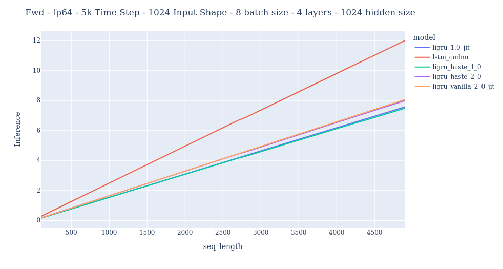
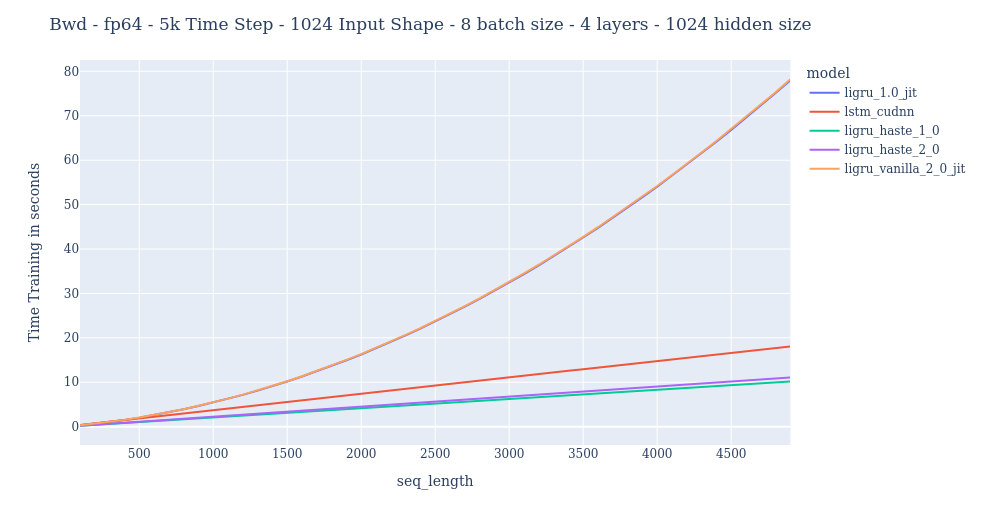
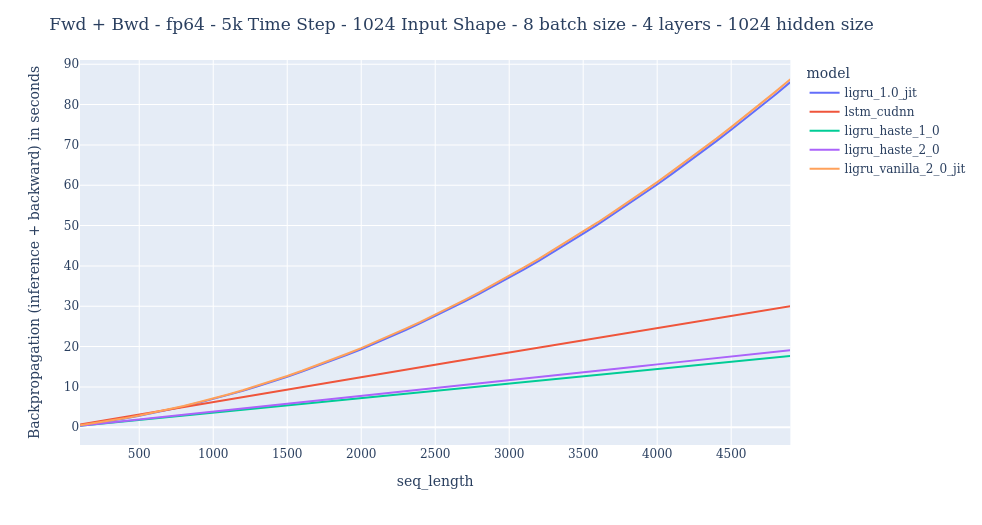
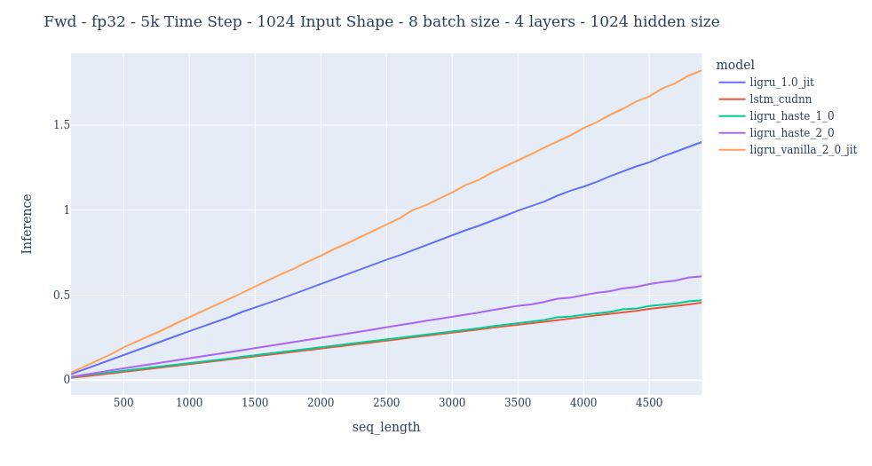
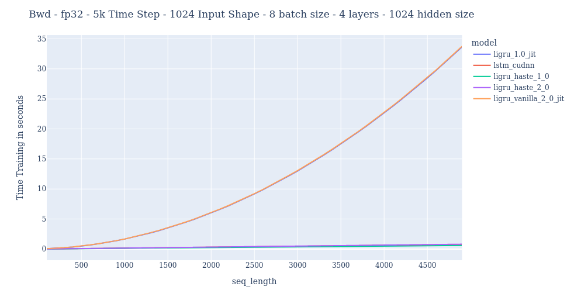
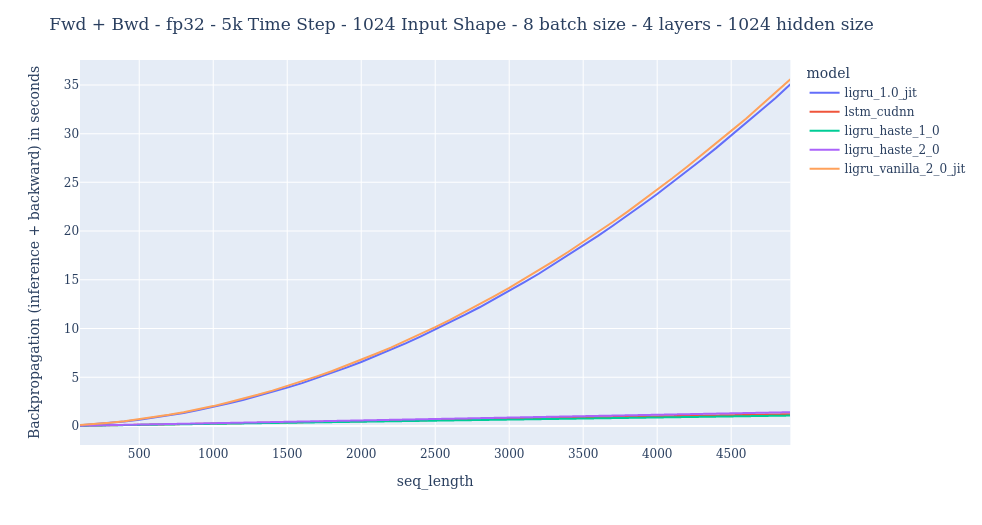

--------------------------------------------------------------------------------
`fast_ligru` is an open-source CUDA implementation that is the fastest public version of the [Light Gated Recurrent Units](https://arxiv.org/abs/1803.10225) (5 times faster than the original one). 
The project rely on the [Haste](https://github.com/lmnt-com/haste) structure, but completely differs on the content implemented. 

We provide two differents implementation: `Li-GRU` and `SLi-GRU` (resp. in the code 'LiGRU 1.0' and 'LiGRU 2.0'). The difference rely on the recurrent connection, in the `SLi-GRU` we apply a layer normalisation on the recurrent weights to reduce the gradient exploding problem. Indeed, the `Li-GRU` is unstable and in practice cannot be trained on medium to large scale dataset (e.g, LibriSpeech 960h, CommonVoice) while the `SLi-GRU` can and was designed for this purpose. 

The `Li-GRU` supports fp64, fp32 and fp16, and the `SLi-GRU` supports fp64 and fp32. Both of them can works with Torch AMP. 

The implementations have been theoretically and empirically checked. We used `torch.autograd.gradcheck` and we scaled the `Li-GRUs` on real dataset such as CommonVoice Italian, French, LibriSpeech 960h and TIMIT, where we got expected results. All the `Li-GRUs` on these datasets have been trained thanks to `SpeechBrain` an all-in-one AI conversational toolkit.

For questions or feedback about `fast_ligru`, please open an issue on GitHub or send me an email at [adel.moumen@univ-avignon.fr](mailto:adel.moumen@univ-avignon.fr).

## Install
Here's what you'll need to get started:
- a [CUDA Compute Capability](https://developer.nvidia.com/cuda-gpus) 3.7+ GPU (required)
- [CUDA Toolkit](https://developer.nvidia.com/cuda-toolkit) 10.0+ (required)
- [PyTorch](https://pytorch.org) 1.3+ for PyTorch integration

Once you have the prerequisites, you can install with pip or by building the source code.

### Building from source
```
make fast_ligru
```

install it with `pip`:
```
pip install fast_ligru-*.whl
```

If the CUDA Toolkit that you're building against is not in `/usr/local/cuda`, you must specify the
`$CUDA_HOME` environment variable before running make:
```
CUDA_HOME=/usr/local/cuda-10.2 make
```

## References
1. Ravanelli, M., Brakel, P., Omologo, M., & Bengio, Y. (2018). Light Gated Recurrent Units for Speech Recognition. arXiv. (https://doi.org/10.1109/TETCI.2017.2762739)

## Citing this work
To cite this work, please use the following BibTeX entry:
```
Will be updated soon!
```

## License
[Apache 2.0](LICENSE)

## Results

### FP64





### FP32




